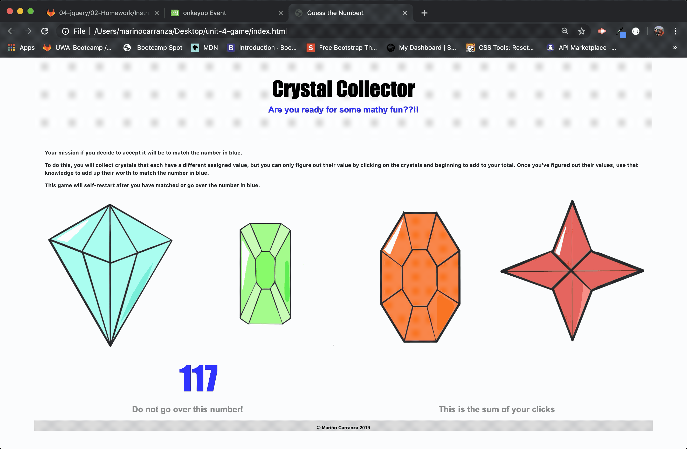

# **Guess the Number!**

### *I have used jQuery to develop this app, I have also used a little bit of boostrap.*

## **Functionality**

The number to be guessed is displayed in blue on the bottom left side of the screen.
This is a randomly generated number between 19 and 120.

Each of the four images or gems displayed in the center has a randomly generated number between 1 and 12 assigned to them.
(*The gems were generously drawn by my daughter*).

The objecive of the game is for the user to guess (without going over) the number displayed by clicking on the gems.

The first click will show the value of the gem, after that each time a gem is clicked the number will be the sum of the values contained in the gems.

The player wins if their total score matches the random number from the beginning of the game.
The player loses if their score goes above the random number.

The game restarts whenever the player wins or loses.

Every time the game begins, the player will see a new random number. Also, all the gems will have four new hidden values.

The app shows the number of wins and loses. To that end, do not refresh the page as a means to restart the game.

### Here is a simple gif to show how the game works

Thanks for taking a look at my app.

Mariño Carranza.

marino.carranza@gmail.com